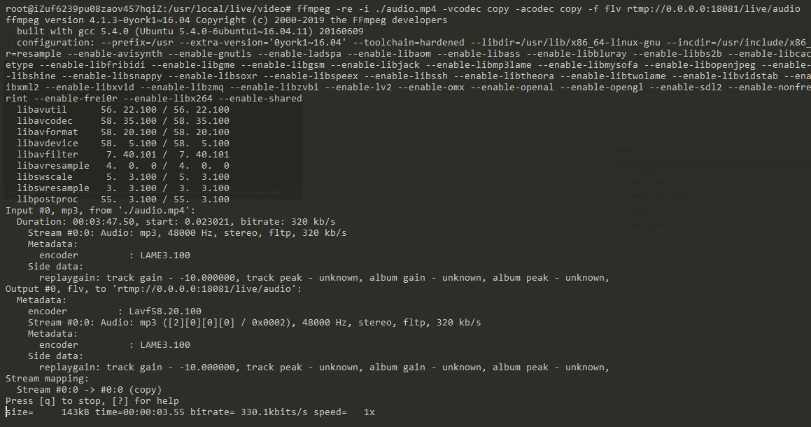
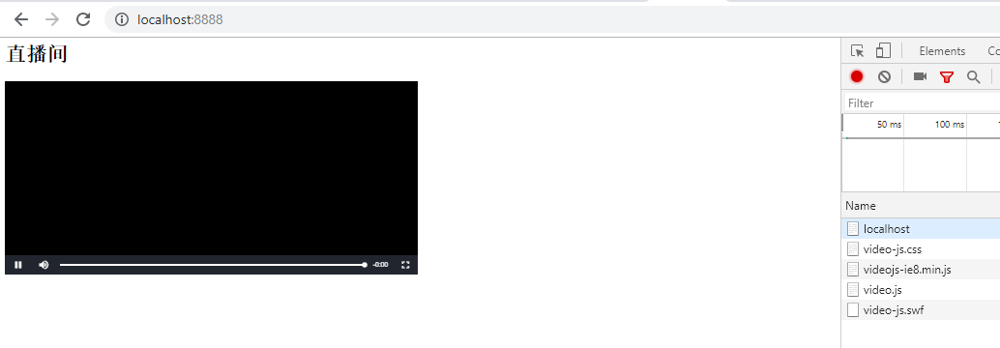

# 基于rmtp的直播技术(已更新)

## 环境
* win10 (收听端)
* vscode
* cmder
* python2.7
* ubuntu16.04 (直播端)

## 安装
* [安装flask](https://flask.palletsprojects.com/en/1.0.x/installation/?highlight=install)

```
$ pip install flask
```
* [直播端搭建](https://blog.csdn.net/g8433373/article/details/96163359)
> 只需要搭建[文章](https://blog.csdn.net/g8433373/article/details/96163359)中的```server```即可

## 运行

* 运行server.py

```
$ python server.py
```

## demo展示
### 直播端(推流)


### 客户端直播(拉流)


## 注意事项
* 浏览器必须要允许flash处于Allow状态
* video.js 6.x版本不支持rtmp协议, 注意使用5.x版本
* 直接打开xxx.html是不会触发播放的, 必须要搭建一个服务

## 参考
[1] [rtmp协议官网文档](https://www.adobe.com/devnet/rtmp.html)

[2] [ffmpeg使用手册](https://ffmpeg.org/ffmpeg-formats.html)

[3] [video.js使用手册](https://docs.videojs.com/tutorial-setup.html)

[4] [video.js播放问题](https://blog.csdn.net/cmqwan/article/details/76059703)

[5] [flask官方文档](https://flask.palletsprojects.com/en/1.0.x/)